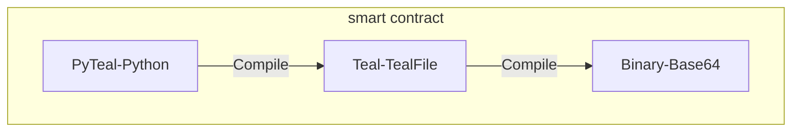

# About the smart contract

## What we need?
We need the final binary to make the transaction.

## How to make it?
- The approval progrm (stateful contract)
> All user use same contract. So we store the final binary for use as any time.
- The escrow program (stateless contract)
> The stateless contract connot store state, It will create an address for escrow. We need embed the id in the contract code. 
> So we can compile `pyteal` to `teal` with a optional application id. When user need it, we just replace it on the `teal` the compile it into the binary.

> P.S. You can look the `Teal` as the assembly code, the `PyTeal` as programming language, Binary as binary code.

## Task Conclusion:
1. Two things needed.
 - [ ] approval program binary.
 - [ ] escrow program teal file.
 2. API
 - [ ] need to be discussed.

## A little thinking
We can use cloudflare worker for some backend.
This can let me to join the work.